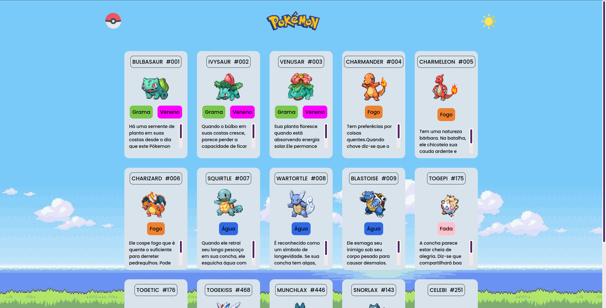
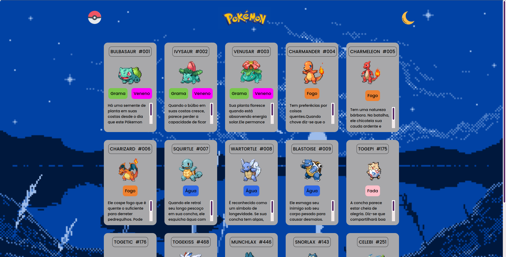

## Listagem de Pokemóns
 
Projeto criado para listagem de alguns Pokemóns.Este projeto possui modo claro e escuro aterado por JavaScript.
Cada Pokemón é representado por um gif e ao passar o mause por cima de cada item da listagem, ela se destaca(:hover).
  
*Modo Claro:*

  
*Modo Escuro:*

  
Para ver o projeto funcionado [AQUI](https://wilgnerfrasao.github.io/projeto-listagem-pokemon/)

